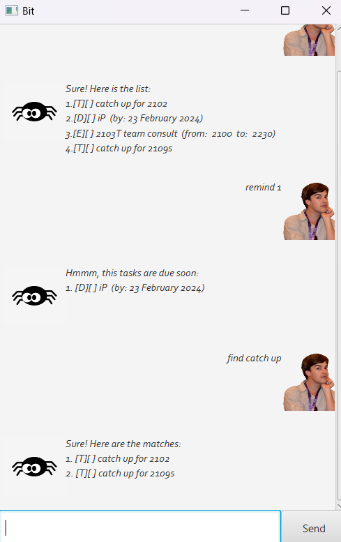

# Bit User Guide

### Bit is a **chat bot made to manage your tasks, made simple with a Command Line Interface (CLI)**, while retaining benefits of GUI

## Adding deadlines

// Describe the action and its outcome.

// Give examples of usage

Example: `keyword (optional arguments)`

// A description of the expected outcome goes here

```
expected output
```

## Adding todos `todo`

Add a todo to be managed by Bit.
Format: `todo TASK`

Examples:
- `todo finish reading`
- `todo sleep early`
- `todo run`

Expected output:
```"I have added this todo: 1.[T][] Task"```

## Adding deadlines `deadline`
Add a deadline to be managed by Bit. Format: `deadline Task /by yyyy-MM-dd`
**The date format must be adhered to.**

Examples:
- `deadline iP /by 2024-02-23`
- `deadline OP1 /by 2024-02-22`

Expected output:
```Done! I have added this deadline: [D][] Task (By yyyy-MM-dd)```

## Adding Events `event`
Add an event to be managed by Bit. Format : `event Task /from start /to end`
There are no limits to what you may set for start and end.

Examples:
- `event hackathon /from Thursday /to Saturday`
- `event family dinner /from 1900 /to 2130`

Expected output:
```I have added this event: Task /from start /to end```

## Listing `list`
list out all tasks you have entered in your tasklist. Format: `list`
Example: 
- `list`

Expected output:
```Sure! Here is the list: ```

## Marking a task `mark`
Mark a task as complete! Format `mark index`

Example:
- `mark 1`
- `mark 2`

Expected output:
```Done and dusted! [T][X] Task```

## Unmarking a task `unmark`
Unmark a previously completed task as incomplete. Format: `unmark index`

Example:
- `mark 1`
- `mark 2`

Expected output:
```Alright. Let me uncheck that for you. [T][] Task```

## Deleting a task `delete`

Delete a task Format: `delete index`

Example:
- `delete 1`
- `delete 2`

Expected output:
```Got it! I have deleted this item: [T][] Task```

## Finding a task `find`
Find a task using a keyword. Format: `find keyword`

Example:
- `find catch`
- `find i`

Note:
- It is ok if you do not remember the whole word, a part of the word will do.

Expected output:
```Sure! Here are the matches: ```

## Reminders `remind`
Bit can remind you of deadlines approaching in a few days or overdue! Format: `remind index`

Example:
- `remind 1`
- `remind 3`

Note:
- The current day is counted as a day. So if you wish to find assignments due tomorrow, `remind 2`

Expected output:
```Hmm... This tasks are due soon: ```

## Bye `bye`
This can be used to close the program safely.

Example: 
- `bye`

Expected output:
- The program should close.
